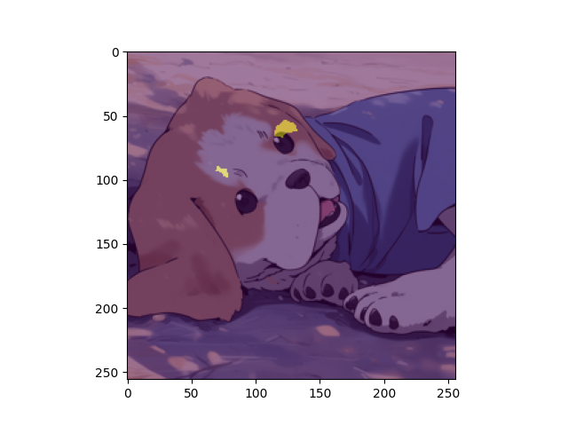

# Deep Fake Detection

## Example 1
A man in a blue shirt and headband

### Real (from Naruto)

### Fake (generated by Animagine XL)

### Prediction (Image Segmentaion - Real/Fake pixels)

## Example 2
a man in a suit and a panda bear

### Real

### Fake 

### Prediction

##  Example 3
a person with blue hair and green eyes

### Real 

### Fake

### Prediction

## BITTENSOR
	- mining cryptocurrency but using the (otherwise wasted compute of the) miners to perform ML tasks (as opposed to running them on cloud-based servers in centralised data centres).  
	- Amazing - using Decentralised computer network (used for cryptocurrency) and utilising the computational effort to perform ML tasks (instead of a central processing data centre).  Such a cool idea

- DOCUMENTATION (https://docs.bittensor.com/learn/introduction)
	- SUBNET (contains the incentive, miner, validator and Bittensor API)
		- INCENTIVE mechanism (the ML task)
		- MINER (the ML model)
		- VALIDATOR (the evaluation metric to score a miner)
	- YUMA consensus (use bittensor API to collect votes/scores from validators)
	- TAO token (the reward)
	- Bittensor API 
		- axon = server instance (uses FastAPI) spawn on miner (to receive incoming Synapse (data object) from validator)
		- dendrite = client instantiated by validator ( to transmit  to axons on miners)
	- memory,cpu,etc
		https://github.com/opentensor/bittensor-subnet-template/blob/main/min_compute.yml

- CODEBASE (https://github.com/BitMind-AI/bitmind-subnet )
	- bitmind/
		- base_miner/
			- deepfake_detectors/
				- camo_detector/ #Content-Aware Model Orchestration (CAMO), a mixture-of-experts breaking the classification into content-specific subproblems (using Gating mechanism to classify subproblem - eg faces, animals, etc)
				- npr_detector/ #fNeighboring Pixel Relationships(NPR) - fine-tuned ResNet50 model for deepfake detection (Rethinking the Up-Sampling Operations in CNN-based Generative Network for Generalizable Deepfake Detection - https://github.com/chuangchuangtan/NPR-DeepfakeDetection)
				- ucf_detector/ #fine-tuned ucf model (xception - Uncovering Common Features for Generalizable Deepfake Detection)
				- tall_detector/ #video detection (thumbnail Layout for Deepfake Video Detection)

		- validator/
			- reward.py/
				- 5% videos, 95% images
				- (mcc/2 + acc/2)*penalty  #0 if pred is invalid number 
				- compute_penalty = 1 if 0<=pred<=1.0 else 0 #(real:0>=pred<=0.5, fake:0.5>pred<=1)
			- miner_performance_tracker.py/
				- MinerPerformanceTracker.get_metrics 
					- accuracy = sklearn.metrics.accuracy_score #window = 10
					- mcc = 0.0 #if len(np.unique(labels)) <= 1
						= max(0,sklearn.metrics.matthews_corrcoef) #window = 100 
							1 = perfect predictions
							0 = random predictions
			- config/
				- TARGET_IMAGE_SIZE = (256,256)
				- IMAGE_DATASETS 
					- bitmind/  #huggingface datasets (https://huggingface.co/collections/bitmind/real-image-datasets-66cfbfaada5d6bbe4d6d2081)
						- bm-real #random photos of people, landscapes, etc
						- open-image-v7-256 #random images from internet, poor quality
						- celeb-a-hq #celebrity faces
						- ffhq-256 #random people faces
						- MS-COCO-unique-256 #random people and objects
						- AFHQ #cat faces
						- lfw #celebrity faces
						- caltech-256 #furniture
						- caltech-101 #animals
						- dtd #texture patterns of objects
				- VIDEO_DATASETS = nkp37/OpenVid-1M, shangxd/imagenet-vidvrd
				- T2I_MODELS #synthetic (text-to-)image generators
					- stabilityai/stable-diffusion-xl-base-1.0 #realistic
					- SG161222/RealVisXL_V4.0 #photo realistic 
					- Corcelio/mobius #realistic movie scenes
					- black-forest-labs/FLUX.1-dev #realistic objects
					- prompthero/openjourney-v4 #3D fantasy style
					- cagliostrolab/animagine-xl-3.1 #Anime style 
				T2V_MODELS #synthetic (text-to)video generators
					- genmo/mochi-1-preview
					- THUDM/CogVideoX-5b #Realistic 
					- ByteDance/AnimateDiff-Lightning #3D Animation style
	
				#prompt-generation
				- IMAGE_ANNOTATION_MODEL = Salesforce/blip2-opt-6.7b-coco #image-to-text LLM (hugging face) to generate image captions
				- TEXT_MODERATION_MODEL = unsloth/Meta-Llama-3.1-8B-Instruct-bnb-4bit #LLM to rephrase generated image captions 

	
- R&D:
	- paperswithcode 
		https://paperswithcode.com/datasets?task=deepfake-detection
	- huggingface
	- google scholar/papers 
		- NPR paper (https://arxiv.org/pdf/2312.10461)
			- simple but effective artifact representation, termed Neighboring Pixel Relationships (NPR)
			- nearest neighbor interpolation results in the local 2×2 pixels sharing the same value. Subsequent to the up-sampling operation
		- UCF paper (https://arxiv.org/pdf/2304.13949)
			- detectors … focus too much on content …not directly related to the forgery, i.e., the background, identity, and facial appearance
			-  different forgery techniques produce distinct forgery artifacts… overfitted to one or more specific forgery technologies, leading to a lack of generalization to unseen forgeries.
		- TALL paper (https://arxiv.org/pdf/2307.07494)
			- perform well on intra-dataset, but their generalizability needs to be improved
			- detect deepfake by modeling spatio-temporal dependencies
			- subtle spatio-temporal inconsistencies between frames…capturing inconsistencies through temporal modeling
			- TALL contains both spatial and temporal information (four frames in one image) so that model can learn both intra-frame artifacts and interframe inconsistency

- STRATEGY/APPROACH
	- vX EXPERIMENTAL: train an image segmentation model to detect fake regions of pixels (for interpretable representation). Then fit binary classification head ontop. Training data: real images all true masks, fake images all false masks.
	- v0: BASELINE : first out to be top of leaderboard - submit a baseline model (e.g. always predicts 1 or 0 or randomly choose - but mcc would be 0, so only half marks)
	- v1: lookup for image in datasets - similarity based retrieval - if none same, could be generated
	- v2: get pre-trained deepfake detectors 
		- typically focus on developing optimal CNN architectures
			- https://huggingface.co/MaanVad3r/DeepFake-Detector
		- visual transformer (ViT)	
			- https://huggingface.co/Wvolf/ViT_Deepfake_Detection
		- discriminator (from GAN)
	- v3: fine-tune model 
		- data:
			 - datasets being used by validator (see above)
			- Additional Public datasets
				- Cifake (https://www.kaggle.com/datasets/birdy654/cifake-real-and-ai-generated-synthetic-images)
				- Artifact (https://www.kaggle.com/datasets/awsaf49/artifact-dataset)
		- adversarial training - optimise discriminator on pre-trained GAN/image generators (same models used in validator)
	   - v4: add additional features 
		- use deep pretrained CNN models as encoding layers		
		- deepfake clues - feature analysis / distribution of real vs synthetic datasets (colours, textures, etc)
			- frequency-domain
				- LOG … information from both color and frequency … 
				- F3- Net …frequency components partition and the discrepancy of frequency statistics between real and forged images
				- details present in the frequency domain of fake images, such as compression artifacts
				- SPSL … frequency-based method by phase spectrum analysis
				- 2d dfft
				- grid-like structure in frequency space 
				- frequency-aware features 
			- colour-based
				-  RGB information to capture the traces in different input spaces separately
			- resolution
				- FWA… leverages differences in resolution between forgery faces and backgrounds to detect deepfake
			- scale-related
				- differences in global texture statistics that provide specific clues to distinguish deepfakes from the real images
				- M2tr … local inconsistencies within frames at different spatial levels
			- text captions
				- LLM add text caption features (image-to-text description)
			- SVD
				This residual shows what is missing when comparing the original data with its rank-one approximation 

	- v5: include videos (5%) as well as images (95%)
		- temporal models such as LSTM and 3D-CNNs
			- spatio-temporal
				- LipForensics…spatial-temporal networks to identify unnatural mouth movements
